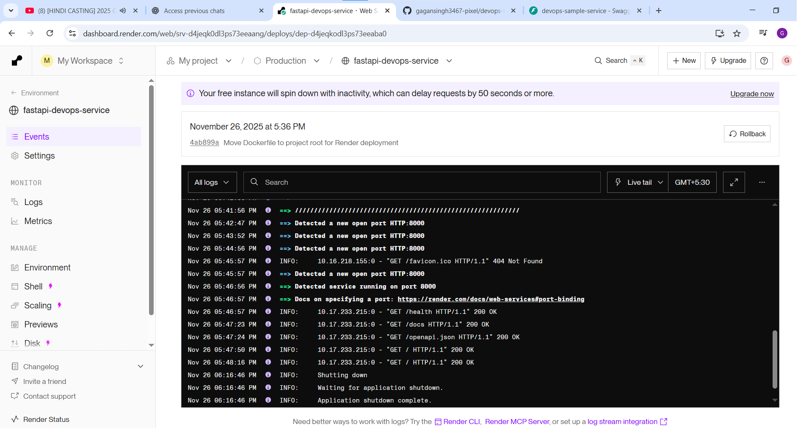
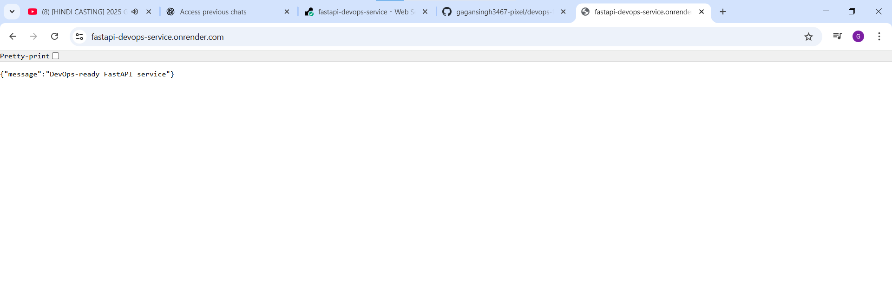
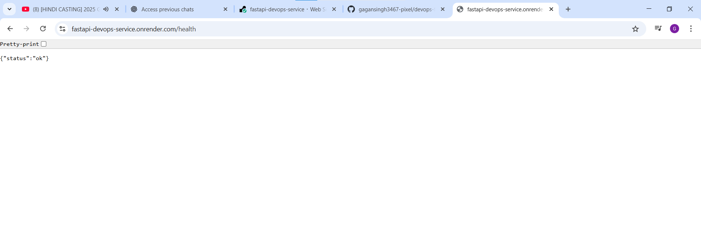
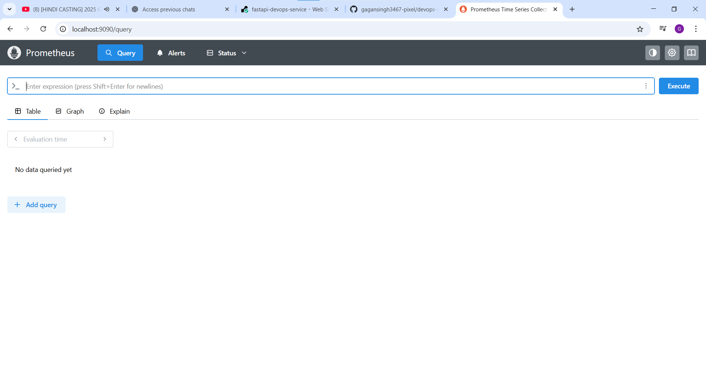
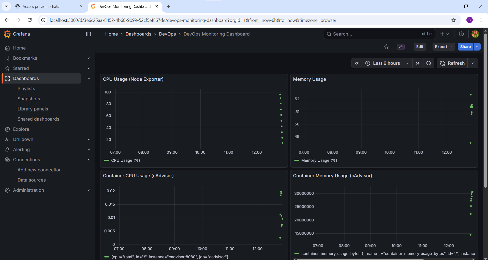
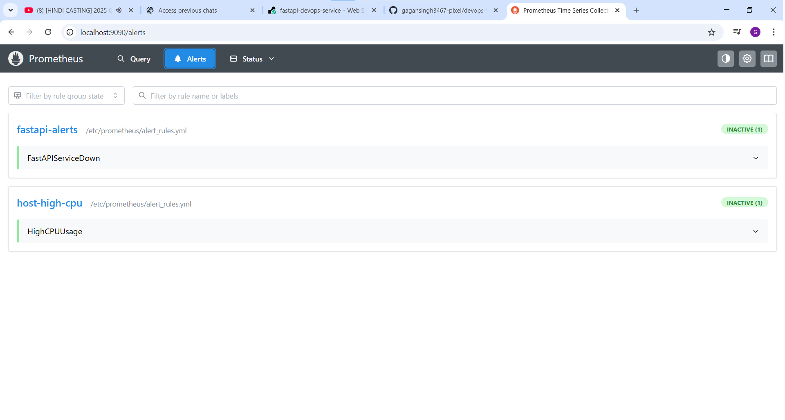

📘 DevOps FastAPI Microservice (Docker + CI/CD + Monitoring)

A simple, production-ready FastAPI microservice containerized with Docker, deployed on Render Cloud, and monitored locally using Prometheus, Grafana, Alertmanager, Node Exporter, and cAdvisor.

This project demonstrates essential DevOps skills:

Containerization with Docker

Cloud deployment on Render (Free Tier)

GitHub Actions CI pipeline

Local monitoring stack

Docker Compose orchestration

Logging, metrics & health checks

🚀 Live Demo (Render Deployment)
## 📸 Screenshots

### Render Deployment Dashboard

### FastAPI Root Endpoint

### Health Check Endpoint

### Swagger API Docs

### Promethius UI

### Grafana Dashboard

### Alertmanager

Your application is deployed publicly using Render:

🔗 https://fastapi-devops-service.onrender.com

API Endpoints
Endpoint	Description
/	Root endpoint
/health	Health check
/docs	Swagger UI
🧩 Project Structure
devops-fastapi-ci-cd/
│── app/                 # FastAPI application
│── docker/              # Monitoring configs (Prom/Grafana)
│── infra/               # Infra configs (optional)
│── monitoring/          # Prometheus & Alertmanager rules
│── scripts/             # Helper scripts
│── Dockerfile           # Main Dockerfile for Render
│── docker-compose.yml   # Local monitoring stack
│── README.md

🐳 Run FastAPI with Docker (Locally)
Build Image
docker build -t fastapi-devops .

Run Container
docker run -p 8000:8000 fastapi-devops

Open:
👉 http://localhost:8000

👉 http://localhost:8000/docs

📊 Monitoring Stack (Local)

Start full Prometheus + Grafana + Alertmanager monitoring:

docker-compose up -d

Default Ports
Service	URL
FastAPI	http://localhost:8000

Prometheus	http://localhost:9090

Grafana	http://localhost:3000

Node Exporter	http://localhost:9100

cAdvisor	http://localhost:8080
☁️ Cloud Deployment (Render)

Render builds automatically from your GitHub repository using your Dockerfile.

Steps:

Go to Render → New Web Service

Select repo → choose Environment: Docker

Root directory:

.

Region: Singapore

Instance Type: Free

Click Create Web Service

Render will automatically:

✔ Build your Dockerfile
✔ Run Uvicorn
✔ Expose a public URL

🔄 CI Pipeline (GitHub Actions)

The CI workflow:

Checks out code

Sets up Python

Installs dependencies

Runs tests

(Optional: builds Docker image)

Workflow file is inside:

.github/workflows/ci.yml

📝 Resume Project Summary

Containerized a FastAPI microservice using a multi-stage Dockerfile and deployed it on Render Cloud.

Built a local monitoring stack with Prometheus, Grafana, Alertmanager, Node Exporter, and cAdvisor using Docker Compose.

Implemented GitHub Actions CI pipeline for automated builds and testing.

Added health checks, API documentation, and metrics endpoints for observability.

Documented the deployment process with clear instructions.
